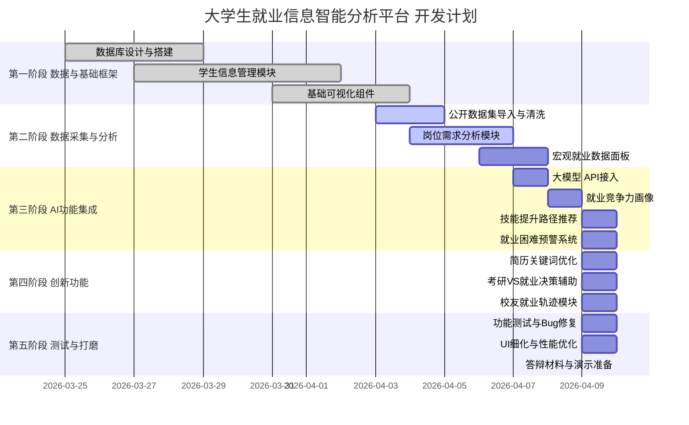

# 大学生就业信息智能分析平台

> 以数据驱动就业决策，用 AI 赋能职业规划

---

## 一、项目背景

当前高校就业工作面临三大痛点：

- **信息孤岛**：学生信息、岗位需求、宏观就业数据分散在不同系统，无法联动分析
- **指导滞后**：辅导员依赖经验和直觉给建议，缺乏数据支撑的个性化指导
- **预判缺失**：学生选专业、选行业时无法参考未来市场变化趋势

本平台旨在整合校内毕业生数据、社会招聘数据与国家宏观就业数据，构建面向高校的**就业全链路智能分析系统**，为学生、辅导员、就业办三类用户提供差异化服务。

---

## 二、目标用户

| 用户角色 | 核心诉求 |
|----------|----------|
| **在校学生** | 了解自己的就业竞争力，获取个性化职业发展建议 |
| **辅导员 / 就业办** | 掌握全院学生就业动态，提前识别就业困难群体 |
| **学校管理层** | 纵向对比历届就业率，为专业调整、课程改革提供依据 |

---

## 三、核心功能模块

### 3.1 学生信息管理与统计（基础层）

- 结构化录入与管理学生档案：学院、学号、生源省份、学籍状态、专业、毕业届次
- 支持 Excel/CSV 批量导入，自动校验数据完整性
- 多维度筛选与检索：按学院、专业、省份、就业状态等组合过滤
- 统计面板：在校人数、待就业人数、已就业人数、升学人数实时汇总

### 3.2 数据一键可视化（展示层）

- **就业去向分布图**：饼图/桑基图展示就业、升学、出国、待业占比
- **生源地热力地图**：全国省份分布，支持下钻到市级
- **行业流向图**：毕业生进入各行业的比例及同比变化
- **薪资分布直方图**：按专业、学院、地区的薪资区间分布
- 支持按届次切换，查看历年趋势折线图
- 图表支持一键导出（PNG / PDF / Excel）

### 3.3 社会岗位需求分析（供给侧）

- 聚合主流招聘平台（Boss直聘、智联招聘等）公开岗位数据或使用标准开放数据集
- **技能词云**：提取 JD 中高频技能关键词，按行业分类展示
- **岗位地域热力图**：各省市岗位数量及薪资水平分布
- **专业-岗位匹配矩阵**：展示各专业对应的主要岗位方向及市场需求量
- **学历要求分析**：本科/硕士/博士在各行业的占比趋势

### 3.4 AI 就业指导助手（核心亮点）

> 调用大语言模型（DeepSeek / Kimi，符合4C大赛指定工具规范）

#### 个人就业画像
- 输入：学生专业、GPA区间、技能证书、实习经历、目标城市
- 输出：**就业竞争力评分**（0-100分）+ 雷达图展示各维度得分（专业匹配度、技能契合度、地区供需比、薪资预期合理性）

#### 岗位匹配推荐
- 基于学生档案，从数据库中推荐 Top-N 匹配岗位
- 给出每个岗位的**匹配度说明**：哪些条件满足、哪些存在差距

#### 技能提升路径规划
- 分析学生技能与目标岗位的 Gap
- 输出结构化的**学习路径建议**：推荐课程方向、技能优先级排序、预计提升周期

#### 就业困难预警
- 对未就业且接近毕业的学生，AI 自动生成预警标签（技能不足 / 期望过高 / 地区限制等）
- 推送给辅导员，支持批量生成定向辅导建议

### 3.5 宏观就业趋势分析（数据洞察层）

> 数据来源：国家统计局、教育部、人社部公开发布的就业报告、人才紧缺报告

- **省级稀缺岗位地图**：展示各省当前最紧缺的前10类岗位
- **行业景气指数面板**：整合多份政策报告，生成各行业近3年景气趋势
- **未来需求预测**：基于历史数据 + 政策信号，预测3年内各行业人才需求变化方向（增长/持平/萎缩）
- **政策解读摘要**：AI 自动提取最新就业相关政策的关键信息，以简洁卡片形式推送

---

## 四、新颖扩展功能（创新亮点）

### 4.1 专业-市场契合度追踪器

纵向追踪某专业毕业生的**实际就业岗位**是否与专业对口，计算"专业对口率"与"薪资溢价率"，揭示哪些专业存在系统性就业错配，为学校课程改革提供数据依据。

### 4.2 同校历届就业数据纵向对比

- 以届次为时间轴，展示本校就业率、平均起薪、主要去向行业的10年变化趋势
- 支持与省内高校、全国同类院校的横向基准对比（使用教育部公开数据）
- 自动生成年度就业分析报告（Markdown / PDF 导出）

### 4.3 简历关键词优化建议

- 学生输入简历文本，系统对比目标岗位的 JD 关键词
- AI 指出**简历与岗位的语义差距**，给出具体的措辞优化建议
- 类似 ATS（简历筛选系统）模拟评分，帮助学生提升简历通过率

### 4.4 考研 vs 就业决策辅助

- 输入：目标城市、期望薪资、可接受的备考时间
- 系统综合当前学历对应的岗位薪资分布、目标院校录取难度、读研后薪资提升预期
- 输出：**量化的考研回报率分析**，辅助学生做理性决策

### 4.5 校友就业轨迹匿名展示

- 收集（匿名化处理）往届毕业生的就业起点、跳槽轨迹、薪资增长曲线
- 以职业路径图的形式展示：同专业的人5年后在做什么
- 为在校生提供真实的职业预期参考，弥补"只能看到起点"的信息缺失

### 4.6 企业来校招聘热度分析

- 统计历年来校招聘企业名单、职位类型、招聘人数
- 展示哪些企业是本校的高频合作方，哪些是新进企业
- 帮助就业办提前规划招聘季资源对接

---

## 五、技术架构

```
┌─────────────────────────────────────────┐
│               前端层                     │
│  Vue 3 + ECharts + Element Plus          │
│  响应式设计，支持PC/移动端               │
└────────────────┬────────────────────────┘
                 │ HTTP / WebSocket
┌────────────────▼────────────────────────┐
│               后端层                     │
│  FastAPI（Python）                       │
│  RESTful API + 数据处理逻辑              │
│  LLM调用模块（DeepSeek / Kimi API）      │
└───────┬─────────────────┬───────────────┘
        │                 │
┌───────▼──────┐  ┌───────▼──────────────┐
│   数据存储    │  │      数据采集层       │
│  MySQL        │  │  公开数据集导入       │
│  Redis（缓存）│  │  国家统计局数据抓取   │
└──────────────┘  │  招聘平台公开数据集   │
                  └──────────────────────┘
```

### 技术选型说明

| 层次 | 技术选型 | 选型理由 |
|------|----------|----------|
| 前端框架 | Vue 3 + Vite | 生态成熟，上手快，组件丰富 |
| 可视化库 | ECharts 5 | 国内最主流，中文文档完善，图表类型丰富 |
| 后端框架 | FastAPI | Python 原生，与数据分析库无缝集成 |
| 数据库 | MySQL + Redis | 关系型存储学生数据，Redis缓存频繁查询结果 |
| AI 接口 | DeepSeek API | 符合4C大赛指定AI工具规范，中文理解能力强 |
| 数据处理 | Pandas + Numpy | Python 数据分析标准库 |
| 部署 | Docker + Nginx | 容器化部署，便于演示环境搭建 |

---

## 六、数据来源说明

| 数据类型 | 来源 | 合规性 |
|----------|------|--------|
| 学生档案数据 | 学校教务系统（模拟数据 / 脱敏真实数据） | 校内数据，合规使用 |
| 社会招聘岗位 | Amazon Reviews 2023 / 天池招聘数据集 / 公开爬虫数据 | 公开数据集，学术使用 |
| 宏观就业数据 | 国家统计局官网、教育部就业报告（PDF解析） | 政府公开数据 |
| 行业薪资数据 | 智联招聘薪酬报告、猎聘年度报告（公开PDF） | 公开报告 |

---

## 七、项目里程碑




---

## 八、答辩亮点梳理

1. **真实痛点**：高校就业数据孤岛问题普遍存在，选题场景真实
2. **技术完整性**：从数据采集→存储→分析→AI推理→可视化，全链路自研
3. **AI 深度集成**：不是简单调用 API 聊天，而是结合结构化数据生成可量化的就业画像
4. **三类用户设计**：学生端、辅导员端、管理端三个视角，功能层次分明
5. **可演示性强**：核心功能均可在答辩现场实时演示，无需依赖外部网络

---

*文档版本：v1.0 | 创建日期：2026年3月*
